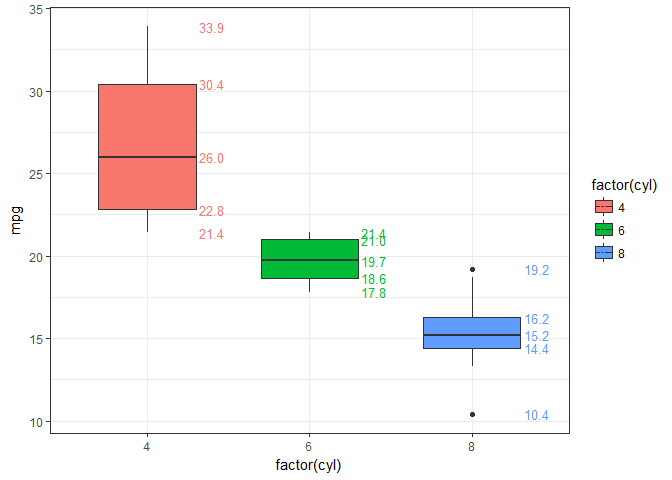

<!-- README.md is generated from README.Rmd. Please edit that file -->

ggplot2: skills & tips
======================

geom\_boxplot
-------------

### add median value to plot

``` r
library(ggplot2)
p <- ggplot(mtcars, aes(x=factor(cyl), y=mpg, fill=factor(cyl))) + 
  geom_boxplot(width=0.6) + theme_bw()
# use stat_summary to add median value annotation
p + stat_summary(geom="text", fun.y=quantile,
               aes(label=sprintf("%1.1f", ..y..), color=factor(cyl)),
               position=position_nudge(x=0.4), size=3.5)
```


