<!-- *.md is generated from *.Rmd. Please edit that file -->


Network visualization with R
============================

igraph
------

from [](http://kateto.net/network-visualization)

### step1 read data

-   links: describes the edges of the network. Its first two columns are the IDs of the source and the target node for each edge. The following columns are edge attributes (weight, type, label, or anything else).
-   nodes: starts with a column of node IDs. Any following columns are interpreted as node attributes. This parameter can be omitted - in that case theigraph object will be generated based solely on the link structure in d.

``` r
library(igraph)

nodes <- read.csv("data/Dataset1-Media-Example-NODES.csv", header=T, as.is=T)
links <- read.csv("data/Dataset1-Media-Example-EDGES.csv", header=T, as.is=T)

# nodes and links data format
head(nodes, 4)
#>    id               media media.type type.label audience.size
#> 1 s01            NY Times          1  Newspaper            20
#> 2 s02     Washington Post          1  Newspaper            25
#> 3 s03 Wall Street Journal          1  Newspaper            30
#> 4 s04           USA Today          1  Newspaper            32
head(links, 4)
#>   from  to weight      type
#> 1  s01 s02     10 hyperlink
#> 2  s01 s02     12 hyperlink
#> 3  s01 s03     22 hyperlink
#> 4  s01 s04     21 hyperlink
```

### igraph object

The description of an igraph object starts with four letters:

-   D or U, for a directed or undirected graph
-   N for a named graph (where nodes have a name attribute)
-   W for a weighted graph (where edges have a weight attribute)
-   B for a bipartite (two-mode) graph (where nodes have a type attribute)

The two numbers that follow (17 49) refer to the number of nodes and edges in the graph. The description also lists node & edge attributes, for example:

-   (g/c) - graph-level character attribute
-   (v/c) - vertex-level character attribute
-   (e/n) - edge-level numeric attribute

``` r
# generate igraph object
net <- graph_from_data_frame(d=links, vertices=nodes, directed=F) 
net          # "net" object
#> IGRAPH UNW- 17 52 -- 
#> + attr: name (v/c), media (v/c), media.type (v/n), type.label
#> | (v/c), audience.size (v/n), weight (e/n), type (e/c)
#> + edges (vertex names):
#>  [1] s01--s02 s01--s02 s01--s03 s01--s04 s04--s11 s05--s15 s06--s17
#>  [8] s08--s09 s08--s09 s03--s04 s03--s04 s01--s15 s01--s15 s01--s15
#> [15] s16--s17 s06--s16 s06--s16 s09--s10 s07--s08 s07--s08 s07--s10
#> [22] s02--s05 s02--s03 s01--s02 s01--s03 s12--s13 s12--s14 s13--s14
#> [29] s12--s13 s05--s09 s02--s10 s03--s12 s04--s06 s03--s10 s03--s10
#> [36] s04--s12 s13--s17 s06--s06 s11--s14 s03--s11 s06--s12 s04--s17
#> [43] s04--s17 s03--s08 s03--s08 s07--s14 s06--s15 s04--s15 s01--s05
#> + ... omitted several edges
E(net)       # The edges of the "net" object
#> + 52/52 edges (vertex names):
#>  [1] s01--s02 s01--s02 s01--s03 s01--s04 s04--s11 s05--s15 s06--s17
#>  [8] s08--s09 s08--s09 s03--s04 s03--s04 s01--s15 s01--s15 s01--s15
#> [15] s16--s17 s06--s16 s06--s16 s09--s10 s07--s08 s07--s08 s07--s10
#> [22] s02--s05 s02--s03 s01--s02 s01--s03 s12--s13 s12--s14 s13--s14
#> [29] s12--s13 s05--s09 s02--s10 s03--s12 s04--s06 s03--s10 s03--s10
#> [36] s04--s12 s13--s17 s06--s06 s11--s14 s03--s11 s06--s12 s04--s17
#> [43] s04--s17 s03--s08 s03--s08 s07--s14 s06--s15 s04--s15 s01--s05
#> [50] s02--s09 s03--s05 s03--s07
V(net)       # The vertices of the "net" object
#> + 17/17 vertices, named:
#>  [1] s01 s02 s03 s04 s05 s06 s07 s08 s09 s10 s11 s12 s13 s14 s15 s16 s17
```

### plot

#### Plotting parameters

Add attributes to the igraph object.

``` r

# basic plot
plot(net)
```


``` r

# remove loops in the graph
net <- simplify(net, remove.multiple = T, remove.loops = T) 
plot(net)
```

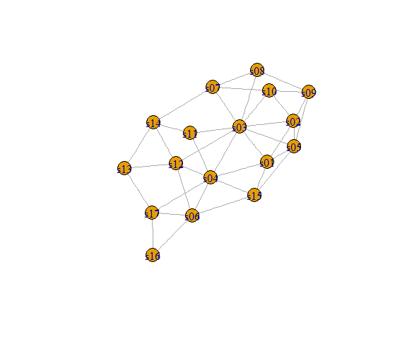

``` r

# Generate colors based on media type:
colrs <- c("gray50", "tomato", "gold")
V(net)$color <- colrs[V(net)$media.type]
plot(net) 
```

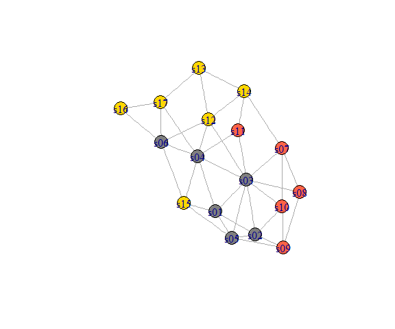

``` r

# Change node border color as node color
V(net)$frame.color <- colrs[V(net)$media.type]
plot(net) 
```

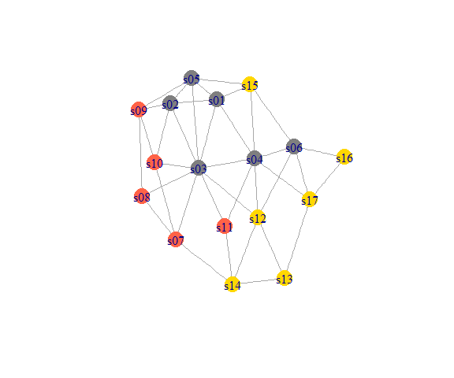

``` r

# Compute node degrees (#links) and use that to set node size:
deg <- degree(net, mode="all")
V(net)$size <- deg*3
plot(net) 
```

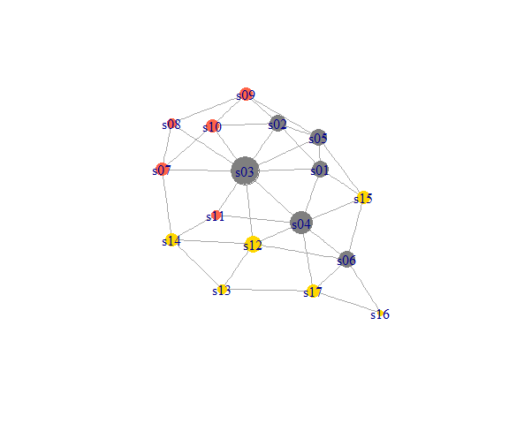

``` r

# We could also use the audience size value:
V(net)$size <- V(net)$audience.size*0.6
plot(net) 
```

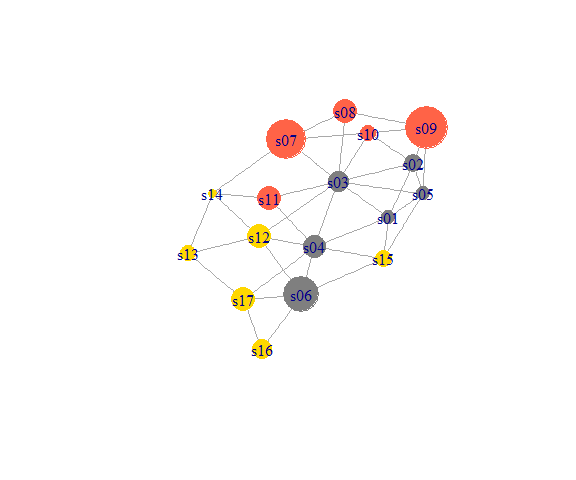

``` r

# The labels are currently node IDs.
# Setting them to NA will render no labels:
V(net)$label <- NA
plot(net) 
```

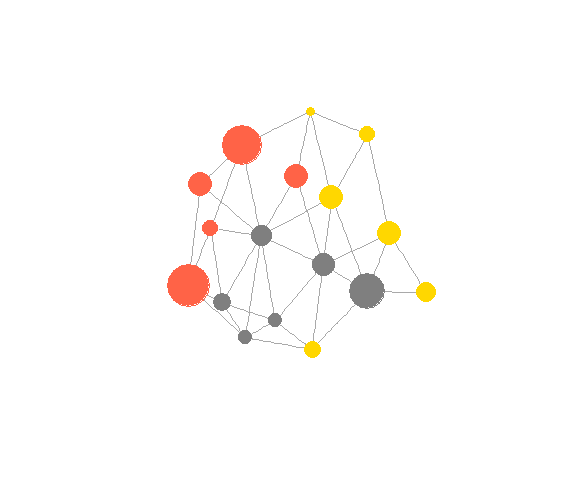

``` r

# Set edge width based on weight:
E(net)$width <- E(net)$weight/6
plot(net) 
```

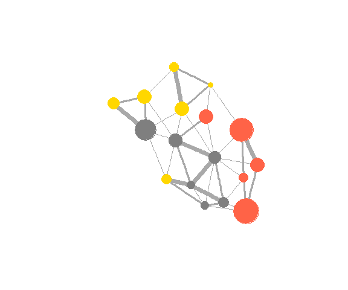

``` r

#change edge color:
E(net)$color <- "blue"
plot(net)
```


``` r

E(net)$color <- "gray80"
# We can even set the network layout:
graph_attr(net, "layout") <- layout_with_lgl
plot(net) 
```

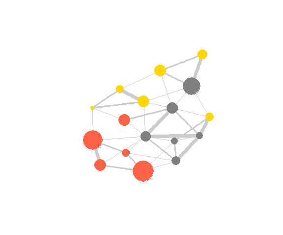

``` r

# remove nodes by connectivity
f_net <- delete.vertices(net,which(degree(net)<4))
plot(f_net)
```

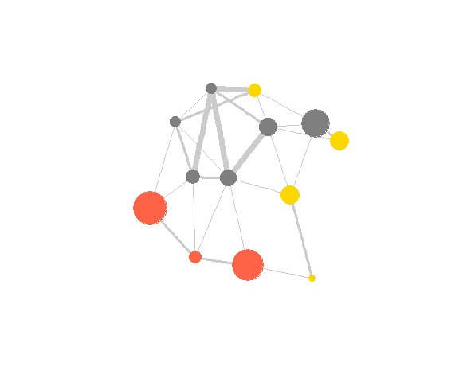

#### Network layouts

``` r
# example data
net.bg <- sample_pa(100) 
V(net.bg)$size <- 8
V(net.bg)$frame.color <- "white"
V(net.bg)$color <- "orange"
V(net.bg)$label <- "" 
E(net.bg)$arrow.mode <- 0
plot(net.bg)
```

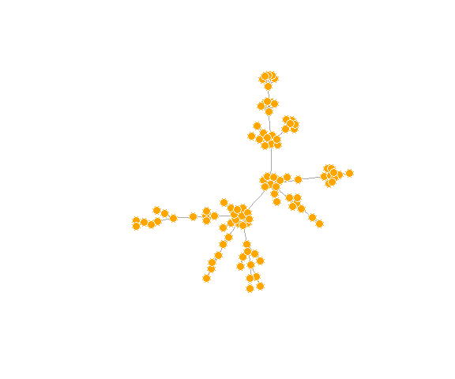

``` r

# Circle layout
l <- layout_in_circle(net.bg)
plot(net.bg, layout=l)
```


``` r

# Fruchterman-Reingold is one of the most used force-directed layout algorithms out there.
# rather slow and therefore less often used in graphs larger than ~1000 vertices. 

l <- layout_with_fr(net.bg)
plot(net.bg, layout=l)
```

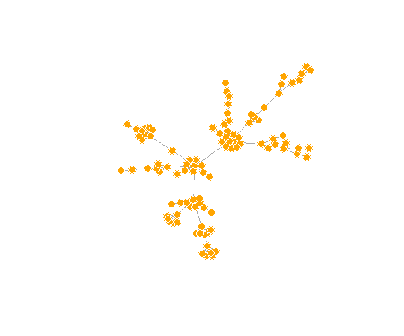

``` r

# Another popular force-directed algorithm that produces nice results for connected graphs is Kamada Kawai. 
l <- layout_with_kk(net.bg)
plot(net.bg, layout=l)
```


``` r

# The LGL algorithm is meant for large, connected graphs. 
# Here you can also specify a root: a node that will be placed in the middle of the layout.
plot(net.bg, layout=layout_with_lgl)
```


#### Highlighting aspects of the network

``` r
par(mfrow=c(1,2))

# Community detection (by optimizing modularity over partitions):
clp <- cluster_optimal(net)
class(clp)
#> [1] "communities"

# Community detection returns an object of class "communities" 
# which igraph knows how to plot: 
plot(clp, net)
 
# We can also plot the communities without relying on their built-in plot:
V(net)$community <- clp$membership
colrs <- adjustcolor( c("gray50", "tomato", "gold", "yellowgreen"), alpha=.6)
plot(net, vertex.color=colrs[V(net)$community])
```


#### Highlighting specific nodes or links

-   Highlight nodes by the distance to specific nodes

``` r
library(RColorBrewer)

dist.from.NYT <- distances(net, v=V(net)[media=="NY Times"], 
                           to=V(net), weights=NA)

# Set colors to plot the distances:
oranges <- colorRampPalette(c("dark red", "gold"))
col <- oranges(max(dist.from.NYT)+1)
col <- col[dist.from.NYT+1]

plot(net, vertex.color=col, vertex.label=dist.from.NYT, edge.arrow.size=.6, 
     vertex.label.color="white")
```


-   Highlight path

``` r

news.path <- shortest_paths(net, 
                            from = V(net)[media=="MSNBC"], 
                             to  = V(net)[media=="New York Post"],
                             output = "both") # both path nodes and edges

# Generate edge color variable to plot the path:
ecol <- rep("gray80", ecount(net))
ecol[unlist(news.path$epath)] <- "orange"
# Generate edge width variable to plot the path:
ew <- rep(2, ecount(net))
ew[unlist(news.path$epath)] <- 4
# Generate node color variable to plot the path:
vcol <- rep("gray40", vcount(net))
vcol[unlist(news.path$vpath)] <- "gold"

plot(net, vertex.color=vcol, edge.color=ecol, 
     edge.width=ew, edge.arrow.mode=0)
```


-   Highlight the edges going into or out of a vertex

``` r

inc.edges <- incident(net,  V(net)[media=="Wall Street Journal"], mode="all")

# Set colors to plot the selected edges.
ecol <- rep("gray80", ecount(net))
ecol[inc.edges] <- "orange"
vcol <- rep("grey40", vcount(net))
vcol[V(net)$media=="Wall Street Journal"] <- "gold"
plot(net, vertex.color=vcol, edge.color=ecol, edge.width=2)
```


-   Highlight the neighbour nodes

To find the neighbors for multiple nodes, use `adjacent_vertices()` instead of `neighbors()`. To find node neighborhoods going more than one step out, use function `ego()` with parameter `order` set to the number of steps out to go from the focal node(s).

``` r
neigh.nodes <- neighbors(net, V(net)[media=="Wall Street Journal"], mode="out")

# Set colors to plot the neighbors:
vcol[neigh.nodes] <- "#ff9d00"
plot(net, vertex.color=vcol)
```


-   "mark" a group of nodes

``` r

par(mfrow=c(1,2))
plot(net, mark.groups=c(1,4,5,8), mark.col="#C5E5E7", mark.border=NA)

# Mark multiple groups:
plot(net, mark.groups=list(c(1,4,5,8), c(15:17)), 
          mark.col=c("#C5E5E7","#ECD89A"), mark.border=NA)
```

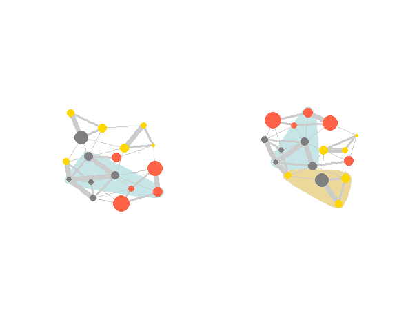

\[[返回首页](../../README.md)\]
