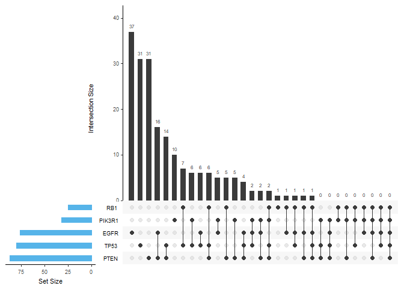

<!-- *.md is generated from *.Rmd. Please edit that file -->


Visualization in R
==================

intersection
------------

### UpSet plot

The UpSet technique visualizes set intersections in a matrix layout and introduces aggregates based on groupings and queries. Can be a good substitute to Venn diagram when set number is more than 5.

[*UpSetR*](https://github.com/hms-dbmi/UpSetR) generates static UpSet plots.

``` r

# example plot
library(UpSetR)
mutations <- read.csv( system.file("extdata", "mutations.csv", package = "UpSetR"), 
                       header=T, sep = ",")
upset(mutations, sets = c("PTEN", "TP53", "EGFR", "PIK3R1", "RB1"), 
      sets.bar.color = "#56B4E9", order.by = "freq", 
      empty.intersections = "on")
```



\[[返回首页](../../README.md)\]
